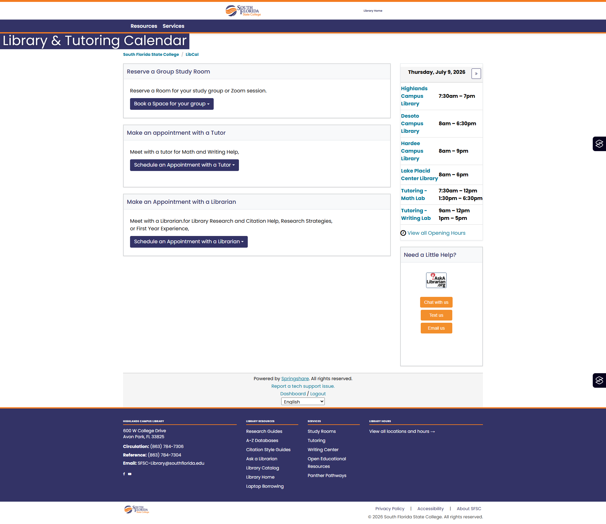
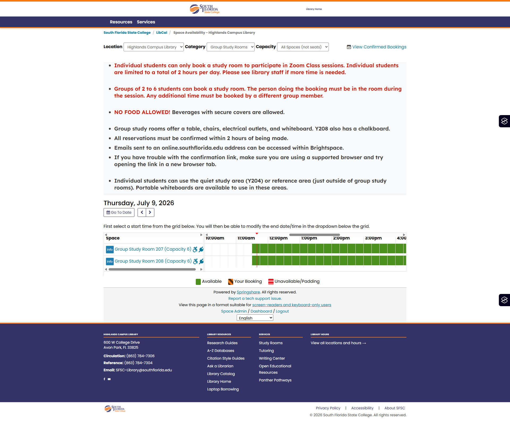
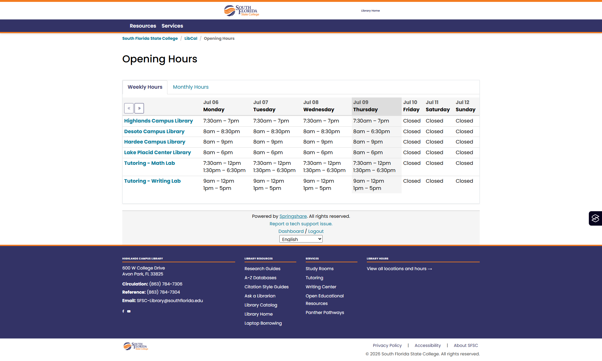
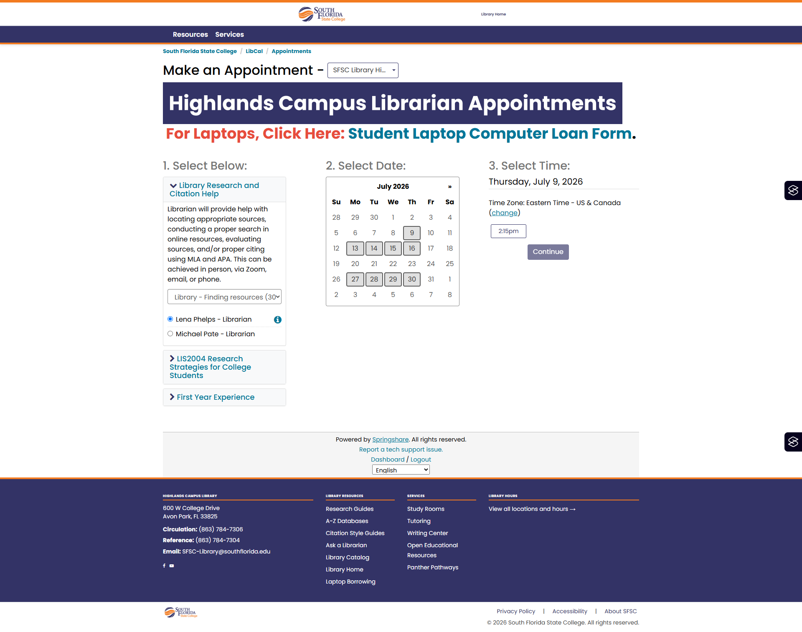
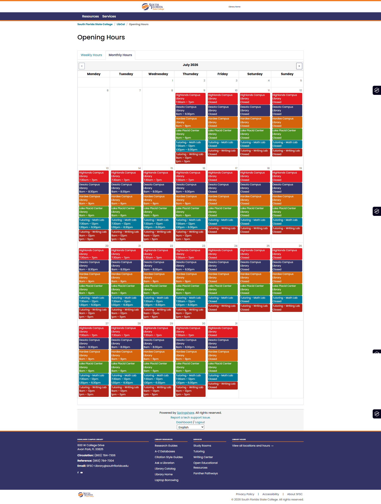
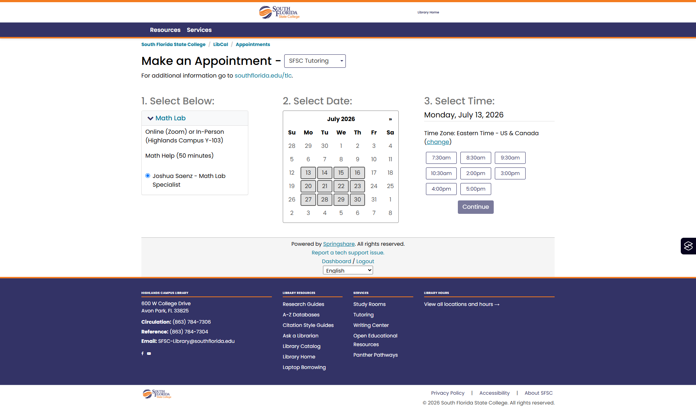

# SFSC LibCal — Bootstrap 3 Port

[LibCal](https://libcal.southflorida.edu) is a separate Springshare product from LibGuides. It remains on Bootstrap 3 — Springshare hasn't announced a BS5 date for it — so this repository carries a thin, token-driven BS3 skin for it, sharing the same brand system as the LibGuides Bootstrap 5 migration documented in [README.md](README.md) and [DESIGN.md](DESIGN.md).

## Files

| File | Where to paste |
|------|---------------|
| `libcalheadincludes.html` | LibCal Look & Feel → Custom JS/CSS Code |
| `libcalheader.html` | LibCal Look & Feel → Custom Header Code |
| `libcalfooter.html` | LibCal Look & Feel → Custom Footer Code |
| `sfsccalcustom.css` | Uploaded via LibCal customization files (served from CloudFront) |
| `sfsccalcustom.js` | Uploaded alongside `sfsccalcustom.css` |
| `libraryhours.html` | LibCal hours widget embed — paste into a LibGuides HTML content box |

## Proof

Current live LibCal pages (Bootstrap 3 skin), styled with the same SFSC brand tokens and contrast rules documented in [DESIGN.md](DESIGN.md):

<table>
  <tr>
    <td align="center">
       
      LibCal homepage
    </td>
    <td align="center">
       
      Book a study room
    </td>
  </tr>
  <tr>
    <td align="center">
       
      Opening hours widget
    </td>
    <td align="center">
       
      Book a librarian appointment
    </td>
  </tr>
  <tr>
    <td align="center">
       
      Monthly hours calendar
    </td>
    <td align="center">
       
      Book a tutor appointment
    </td>
  </tr>
</table>
